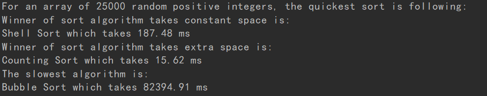

# Sort Compare
compare the running time of top 10 sorting algorithm

## Algorithm
sortFunction file include 10 sorting algorithms. For example, bubble sort, selection sort, quick sort and more.

## Result
Using multiprocessing to speed up the program. Then, print the fastest sorting algorithms using constant space and extra space, also the slowest algorithm.

